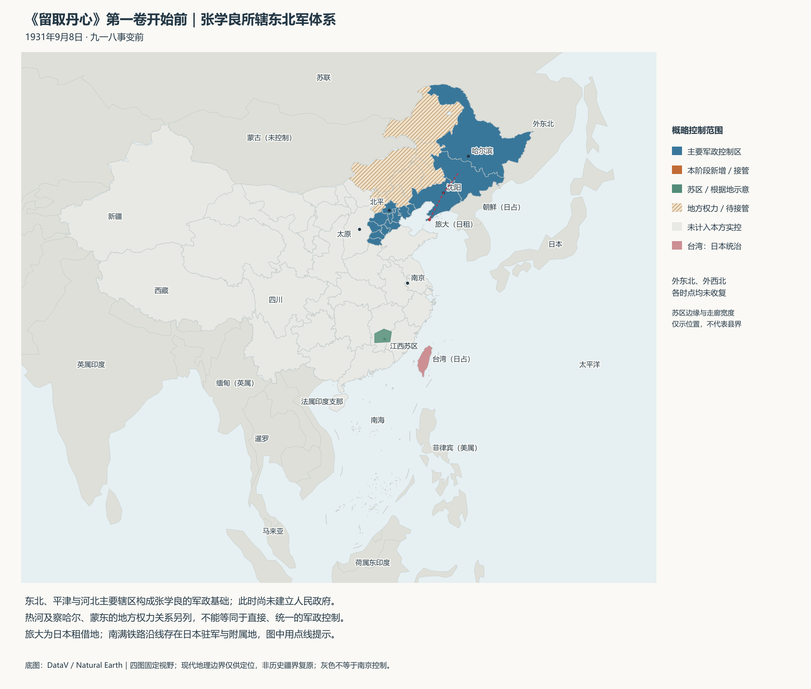
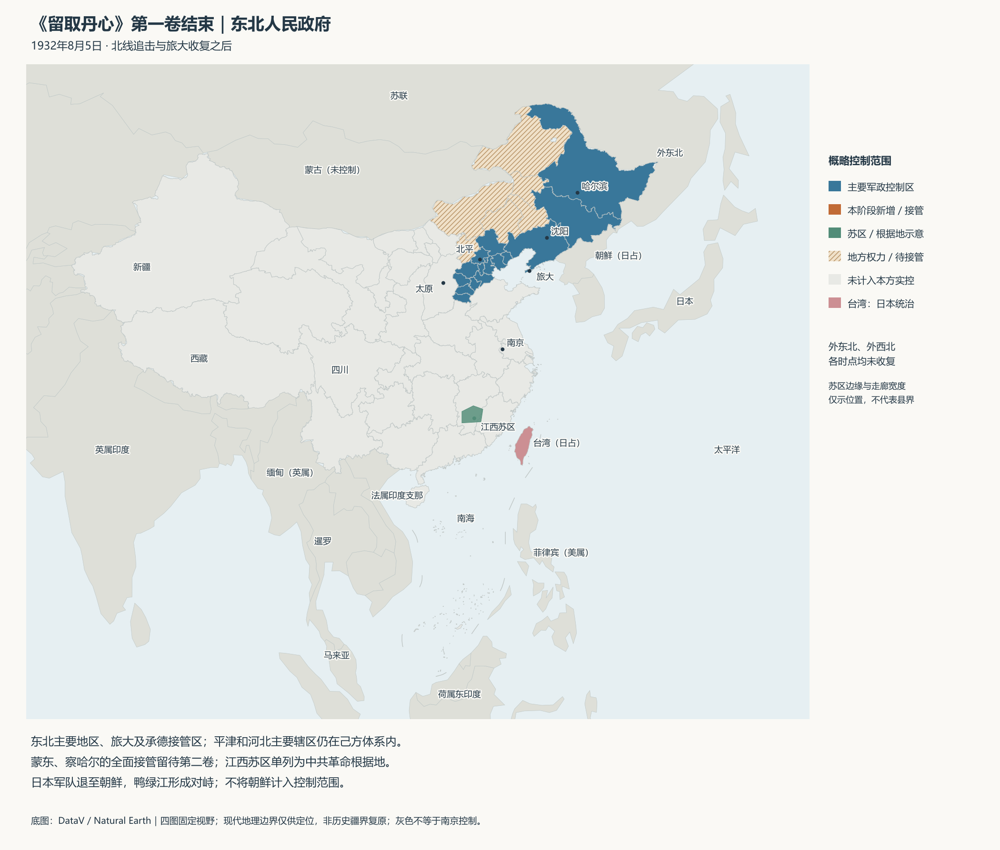
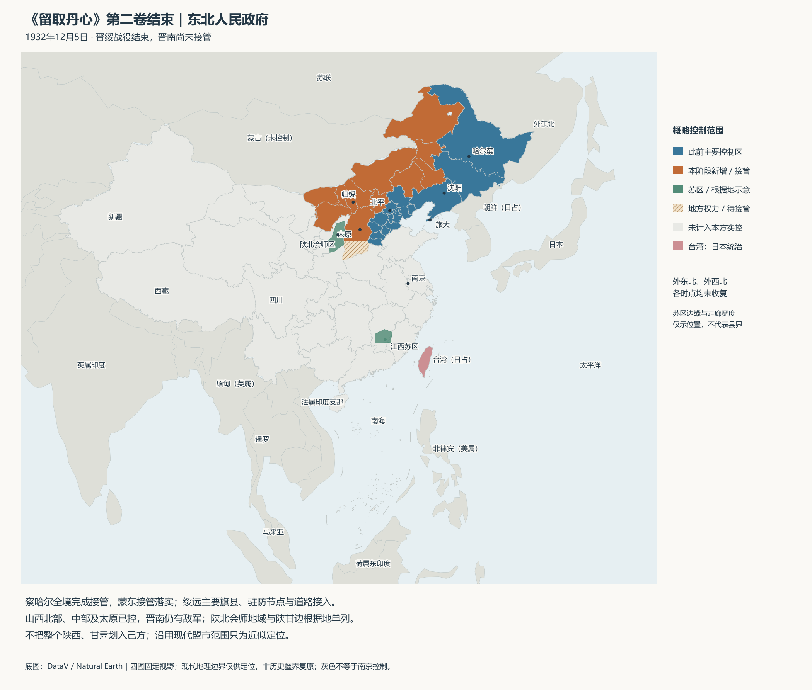
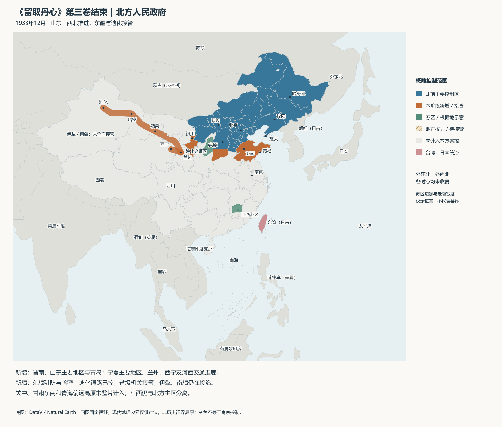

# 留取丹心

**架空历史 · 战争 · 革命 · 家国**

## 小说简介

魏文景，一名来自2023年新中国的医学博士，一觉醒来，成了1931年9月8日身在北平的张学良。

距离九一八事变，只剩十天。

他熟知那段山河破碎的历史，也记得无数未能活着迎来胜利的人。如今，枪声尚未响起，一切似乎还来得及。

可知道历史，究竟能改变多少？面对日寇的步步紧逼、旧部的暗中背叛和南京的重重掣肘，他将如何守住东北，与共产党携手，把抗日的烽火与革命的火种燃遍中国？

他从一个独立的新中国而来。他想让那些为她流尽鲜血的人，也能亲眼看见她站起来。

## 分卷与阅读

| 卷次 | 卷名 | 发布状态 |
| --- | --- | --- |
| 第一卷 | **山河未肯休** | 已完结，第1—60章，本仓库提供全文 |
| 第二卷 | **关山从头越** | 已完结，第61—120章，本仓库提供全文 |
| 第三卷 | **长缨缚苍龙** | 修订中，暂未在本仓库发布 |

**[开始阅读第一卷](chapter-001.md)** · **[第一卷目录](CONTENTS.md)** · **[下载第一卷 TXT](https://github.com/PercyJacksonweiwenjing/liuqvdanxin/raw/refs/heads/main/留取丹心_第一卷.txt)**

**[开始阅读第二卷](chapter-061.md)** · **[第二卷目录](CONTENTS-V2.md)** · **[下载第二卷 TXT](https://github.com/PercyJacksonweiwenjing/liuqvdanxin/raw/refs/heads/main/留取丹心_第二卷.txt)**

两卷均免费阅读、免费下载。点击下载链接后，若浏览器直接显示正文，可使用“另存为”保存为 `.txt`；也可打开仓库中的 TXT 文件，点击 **Download raw file** 下载。

本书为架空历史小说，历史背景与虚构情节交织，请勿将小说情节当作史实引用。

## 故事疆域图

以下四图采用相同视野，展示各阶段的主要控制范围，包含蒙古、朝鲜、日本及东南亚等周边地区。**含第一至第三卷剧情信息，第三卷地图为修订中版本。** 点击图片可查看大图。

### 第一卷开始前 · 1931年9月8日

张学良所辖东北军体系，人民政府尚未建立。

### 第一卷结束 · 1932年8月5日

《山河未肯休》卷终，东北人民政府控制范围。

### 第二卷结束 · 1932年12月5日

《关山从头越》卷终，晋绥战役后的控制范围。

### 第三卷结束 · 1933年12月（修订中）

《长缨缚苍龙》卷终，北方人民政府控制范围。

地图为小说设定示意，非真实历史疆域图，亦不等同于《留取丹心》游戏 MOD 的开局版图。底图采用 DataV 与 Natural Earth 地理数据，现代边界仅供定位；苏区边缘、交通走廊宽度不代表精确县界，灰色地区不等于南京直接控制。

## 支持创作

如果这个故事曾让你热血、难过，或让你愿意陪这些人物再走一程，欢迎自愿赞助，支持《留取丹心》的后续创作。

**赞助完全自愿，不影响免费阅读与下载。量力而行，你愿意读下去，本身就是支持。**

| 支付宝 | 微信 |
| :---: | :---: |
|  |  |

点击图片可查看原图。支付前请在支付应用中核对收款人信息。

## 交流与勘误

欢迎通过本仓库的 [Issues](https://github.com/PercyJacksonweiwenjing/liuqvdanxin/issues) 留下阅读感想，或指出错字、时间线及情节问题。涉及后续情节时，请标明剧透章节。

## 版权说明

《留取丹心》版权由作者保留。本仓库公开提供阅读与个人下载，不代表作品采用开源软件许可证，也不授予未经许可的商业使用、出版或改编权。转载请先联系作者。
